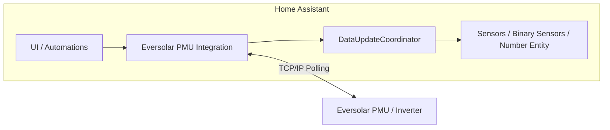

# Eversolar PMU Home Assistant Integration

A native Home Assistant custom integration for Eversolar solar inverter Power Management Units (PMUs).

NOTE: This current version is stand-alone and embeds the pmu protocol directly. The written rules of HACS
      specifically state that this is not a valid arrangement for inclusion in the hacs/default repo.
      Therefore, release v1.2.1 is fixed - as is, and can be installed as a custom repo, external to the
      HACS store. The next release of this software is already in build.
      The new protocol components are already extracted and available as a pypi resource:
            `https://pypi.org/project/eversolar-pmu-protocol/`

Repository: `https://github.com/aburow/eversolar-pmu-ha`

## Highlights

- Local polling over TCP/IP (no cloud)
- HACS compatible (`hacs.json` present)
- Config flow + options flow
- 14 sensor entities, 2 binary sensors, and 1 number entity
- No external Python dependencies

## Architecture



## Installation

### HACS (recommended)

1. Open Home Assistant and go to HACS.
2. Go to Integrations.
3. Open the three-dot menu and select Custom repositories.
4. Add: `https://github.com/aburow/eversolar-pmu-ha`
5. Category: Integration.
6. Click Create, then search for “Eversolar PMU”.
7. Install and restart Home Assistant.

### Manual

1. Copy `custom_components/eversolar_pmu/` into your Home Assistant `custom_components/` directory.
2. Restart Home Assistant.

## Configuration

After restart:

1. Go to Settings → Devices & Services.
2. Click Add Integration.
3. Search for “Eversolar PMU”.
4. Enter the host/IP of your inverter.

Initial config fields:

- Host: required (example: `192.0.2.10`)
- Port: default `8080`
- Scan interval: default `60` seconds (range `10`-`300`)
- Timeout: default `5.0` seconds (range `1.0`-`30.0`)

## Options

Open the integration’s Configure button to set options:

- Scan interval: `10`-`300` seconds
- Timeout: `1.0`-`30.0` seconds
- Auto sync enabled: `true`/`false` (default `false`)
- Auto sync delay: `0`-`60` seconds (default `1`)
- PV voltage threshold: `1`-`200` V (default `50`)
- PV voltage stats cutoff: `1`-`200` V (default `20`)

Notes:

- The PV voltage cutoff is also exposed as a number entity in the UI.
- Auto sync settings control automatic PMU time synchronization behavior.

## Entities

### Sensors (14)

Core telemetry:

| Name | Unit | State class | Notes |
| --- | --- | --- | --- |
| Power | W | measurement | AC power output |
| AC Voltage | V | measurement | AC output voltage |
| AC Frequency | Hz | measurement | Grid frequency |
| Energy Today | kWh | total | Daily energy |
| Total Energy | kWh | total_increasing | Lifetime energy |
| Total Operation Hours | h | total_increasing | Lifetime run hours |
| PV Voltage | V | measurement | PV string voltage |
| PV Current | A | measurement | PV string current |
| PV Power | W | measurement | Estimated PV power |

Additional sensors:

| Name | Type | Category | Notes |
| --- | --- | --- | --- |
| AC Online Time | timestamp | diagnostic | Last time AC reported online |
| AC Offline Time | timestamp | diagnostic | Last time AC reported offline |
| Operation Mode | enum/text | diagnostic | Current inverter mode |
| Error Message | text | diagnostic | Decoded error flags |
| Daily Efficiency | % | diagnostic | Derived efficiency metric |

### Binary sensors (2)

| Name | Meaning |
| --- | --- |
| DC Online | On when inverter is not fully down |
| Time Sync | On when last time sync succeeded |

### Number entities (1)

| Name | Unit | Range | Meaning |
| --- | --- | --- | --- |
| PV Voltage Stats Cutoff | V | 1-200 | Suppresses stats when PV is below cutoff |

## Service

### `eversolar_pmu.sync_time`

Synchronize the PMU’s internal clock to the host time.

Service data:

- `config_entry_id` (required): the integration instance ID from Settings → Devices & Services

Example automation:

```yaml
automation:
  - alias: Sync Eversolar Time Daily
    trigger:
      - platform: time
        at: "02:00:00"
    action:
      - service: eversolar_pmu.sync_time
        data:
          config_entry_id: "abc123def456"
```

## Troubleshooting

### Cannot connect

Check basic connectivity:

```bash
ping 192.0.2.10
nc -zv 192.0.2.10 8080
```

Then:

- Confirm the inverter is powered on.
- Confirm port `8080` is reachable from Home Assistant.
- Increase the timeout option if the network is slow.

### Entities are unavailable or intermittent

- Wait at least one full scan interval after setup.
- Check Home Assistant logs for errors.
- If PV voltage is low, stats-oriented sensors may be suppressed by the cutoff setting.

### Enable debug logging

```yaml
logger:
  logs:
    custom_components.eversolar_pmu: debug
```

## Entity ID pattern

Entity IDs will look like:

```text
sensor.eversolar_inverter_<inverter_id>_<sensor_key>
```

Example keys include: `power`, `ac_voltage`, `ac_frequency`, `energy_today`, `total_energy`, `total_operation_hours`, `pv_voltage`, `pv_current`, `pv_power`.

## Multiple inverters

You can add multiple instances:

1. Settings → Devices & Services → Add Integration
2. Search for “Eversolar PMU”
3. Enter a different inverter host/IP

Each instance creates its own device and entities.

## Support

- Issues and feature requests: `https://github.com/aburow/eversolar-pmu-ha/issues`
- Documentation and source: `https://github.com/aburow/eversolar-pmu-ha`

## License

This project is licensed under GPL-3.0. See `LICENSE`.

## Version compatibility

- Integration version: `1.2.0` (from `custom_components/eversolar_pmu/manifest.json`)
- Home Assistant: modern versions recommended
- Python: matches Home Assistant runtime
